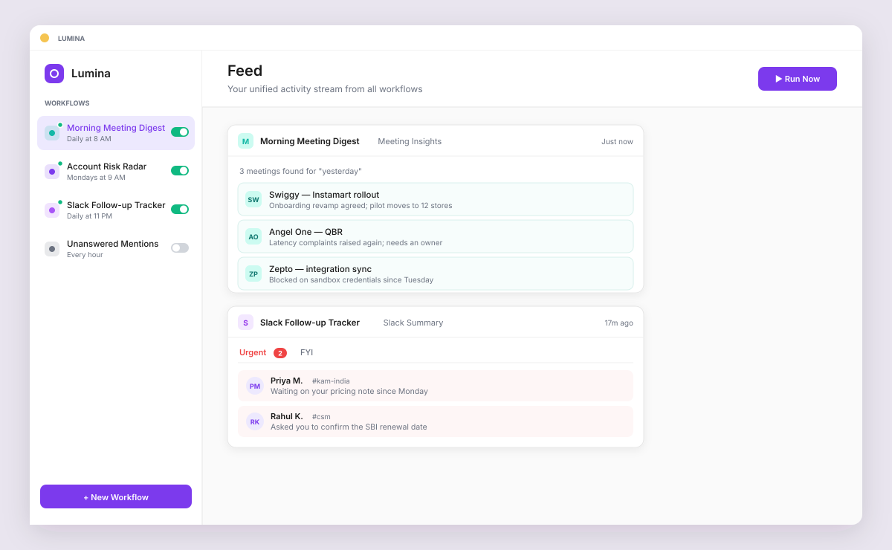
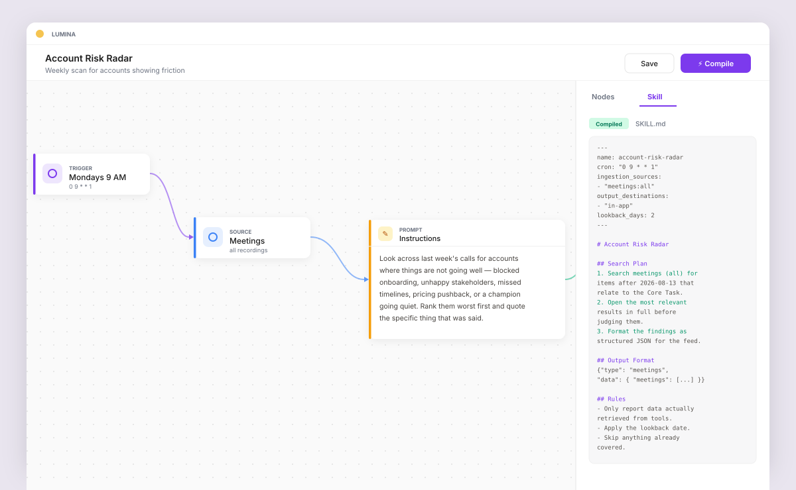
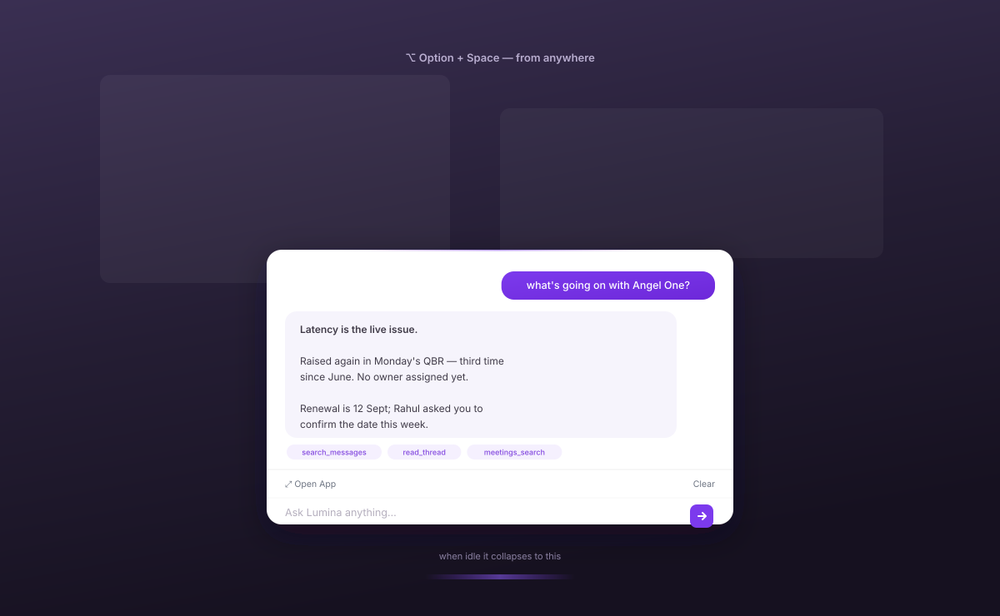

# Lumina — Your Autonomous Chief of Staff

**Project site: [lumina-chief-of-staff.nyrp08.chatgpt.site](https://lumina-chief-of-staff.nyrp08.chatgpt.site/)**

An Electron desktop app that lives at the bottom of your screen as a thin sliver, wakes on
`Option+Space`, and quietly runs recurring workflows across Slack, Notion, and meeting
recordings.

## Demo

<video src="https://github.com/ascension-ai/lumina-app-prototype/raw/main/demo.mp4" controls muted playsinline width="720">
  <a href="demo.mp4">Watch the demo (28s)</a>
</video>

[▶ demo.mp4](demo.mp4) — 28s: waking the bar, asking about an account, and the answer
coming back with the tools it used.

## Product walkthrough

Three scenes covering the main flows, if you'd rather read than watch. The page they come
from is animated and self-contained — no install, no build.

**Morning brief** — the feed as a live intelligence stream: what ran overnight, what needs you



**Workflow compiler** — plain-English intent becoming an inspectable, schedulable workflow



**Ambient answers** — the bar answering from anywhere, without switching apps



These are stills. For the animated version open `design/app-snapshots/index.html` in any
browser — arrow keys to navigate, Space to pause, `?scene=2` to jump straight to one — or
[view it rendered](https://htmlpreview.github.io/?https://github.com/ascension-ai/lumina-app-prototype/blob/main/design/app-snapshots/index.html)
without cloning.

---

## What is your idea?

Lumina is an autonomous chief of staff that turns everyday responsibilities into dependable,
recurring workflows.

You describe an outcome in plain English—such as finding unresolved promises in Slack,
tracking competitor updates, or preparing meeting follow-ups. Lumina converts that intent
into a transparent, inspectable workflow, gathers context across your tools, runs it on
schedule, and returns only what needs your attention.

Unlike a chatbot that waits for questions, Lumina remembers to look—quietly handling the
small responsibilities that otherwise consume time and mental energy.

## What value does it add?

Lumina reduces the mental load of remembering, searching, and following up across scattered
tools. It turns recurring responsibilities into reliable workflows that run automatically,
while keeping every action transparent and under the user's control.

The result is fewer missed commitments, faster access to relevant context, less repetitive
work, and more time for decisions that genuinely require human judgment.

---

## How it works

**Workflows are compiled, not just prompted.** In the Studio you drop a trigger, one or more
sources, and an output onto a canvas, then write what you want in plain English. Hitting
**Compile** turns that into a `SKILL.md` runbook — pre-computed search queries, a lookback
window derived from the schedule, and an output schema. The agent follows a runbook rather
than improvising nightly, which is what makes scheduled runs repeatable.

**Two ways in.** The floating bar answers ad-hoc questions without breaking your flow. The
expanded app holds the feed of everything workflows have produced, plus a chat panel for
longer analysis.

**Answers say what they actually looked at.** Chat routes quick lookups and heavier
analytical questions to different models, and every structured tool response carries the
exact scope it computed — the time window, the population, the metric — surfaced in the UI
so a wrong assumption is visible immediately rather than buried in a confident number.

## Running locally

Requires Node 18+, macOS (the floating bar uses `Option+Space` and transparent-window
behaviour), and an `ANTHROPIC_API_KEY` in a `.env` file one directory above this repo.

**Order matters** — the MCP tool server must be listening before Lumina boots, because the
connection is made once at startup and is not retried:

```bash
# terminal 1 — your MCP tool server on :9515
cd "$MCP_SERVER_DIR" && npm run dev:mcp

# terminal 2 — Lumina
npm install
npm start          # vite + electron
```

Then press `Option+Space`. The bar is click-through while asleep, so the shortcut is the only
way to wake it, and it re-sleeps after a few idle seconds. Send a message and an **Open App**
button appears, which expands to the full window.

Without an API key the app still boots and workflows return simulated results.

| Script | Does |
|---|---|
| `npm start` | vite + electron together |
| `npm run dev` | renderer only |
| `npm run electron` | main process only (expects vite on :5173) |
| `npm run build` | production renderer bundle |

## Architecture

```
React renderer (src/)  ──IPC via preload──  Electron main (electron/)  ──  External
  zustand store                               main.js       window + IPC     Anthropic API
  FloatingBar / Feed / Studio                 scheduler.js  node-cron        MCP tools :9515
                                              agent.js      workflow runs    meeting recordings
                                              chatAgent.js  chat + routing
                                              compiler.js   SKILL.md
                                              database.js   ~/.lumina/db.json
```

Storage is a single JSON file at `~/.lumina/db.json` — deliberate, for desktop-scale data with
no native dependencies. Compiled skills are written to `~/.lumina/skills/<name>/SKILL.md`.

`contextIsolation` is on and `nodeIntegration` off; every renderer capability is hand-listed in
`electron/preload.js`, which is the app's full public API surface.

## Demo data

The bundled meeting corpus is a frozen snapshot, so relative queries ("last week") stop
matching as time passes. `scripts/shift-demo-dates.mjs` re-bases it so the newest record lands
on today, preserving relative spacing:

```bash
node scripts/shift-demo-dates.mjs                      # dry run
node scripts/shift-demo-dates.mjs --apply --reset-last-run
```

Back up `~/.lumina/db.json` and the meeting data first — neither is tracked here.
